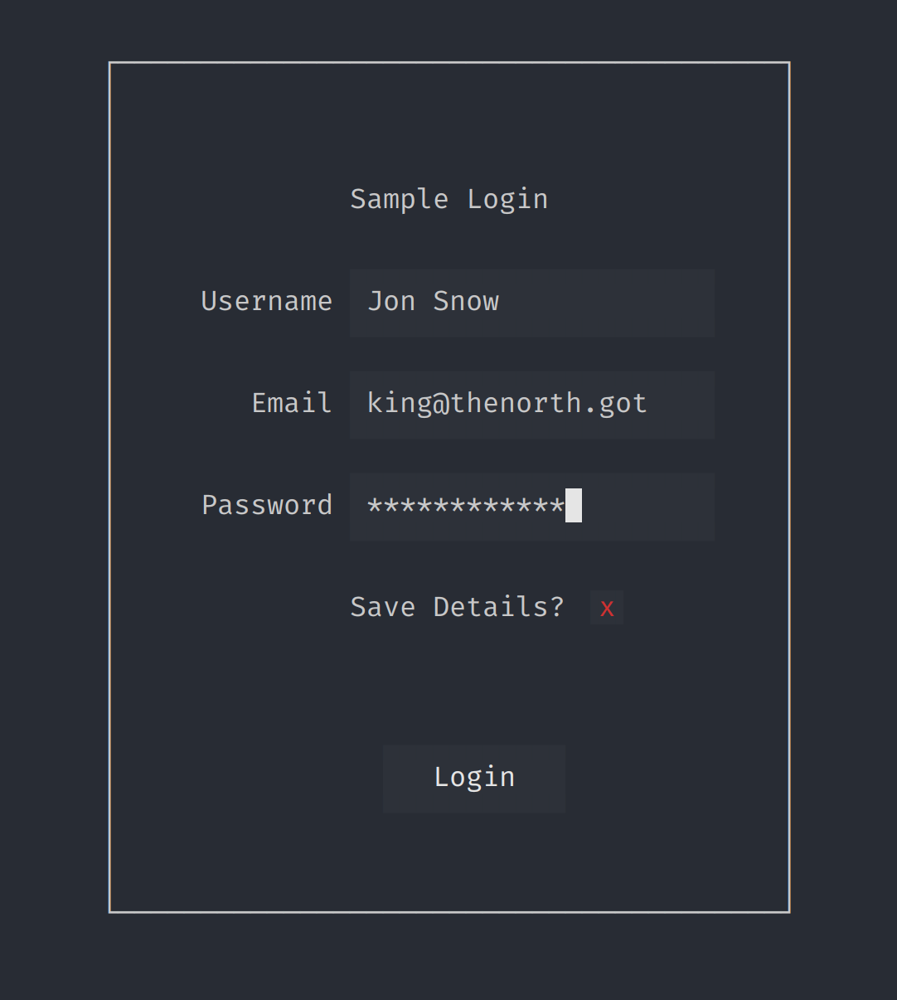

# tbui

Simple extension to the nsf/termbox-go library to allow for quickly creating terminal ui forms

### Use
A full example is available in the examples,

```go

import ui "github.com/tarb/util/tbui"

...

uname := &ui.EditBox{Width: 20, Padding: ui.Padding{0, 1}, Submit: submit}
email := &ui.EditBox{Width: 20, Padding: ui.Padding{0, 1}, Submit: submit}
pswd := &ui.EditBox{Width: 20, Padding: ui.Padding{0, 1}, HideContent: true, Submit: submit}
save := &ui.CheckBox{Padding: ui.Padding{1, 0}, Submit: submit}

window := &ui.VLayout{ 		
    Children: []ui.Element{
        &ui.Text{Text: "Sample Login", Padding: ui.Padding{1}, Width: 30, Allign: ui.Center},
        &ui.HLayout{Children: []ui.Element{&ui.Text{Text: "Username", Padding: ui.Padding{1}, Width: 8}, uname}},
        &ui.HLayout{Children: []ui.Element{&ui.Text{Text: "Email", Padding: ui.Padding{1}, Width: 8, Allign: ui.Right}, email}},
        &ui.HLayout{Children: []ui.Element{&ui.Text{Text: "Password", Padding: ui.Padding{1}, Width: 8}, pswd}},
        &ui.HLayout{Children: []ui.Element{&ui.Text{Text: "Save Details?", Padding: ui.Padding{1}, Width: 22, Allign: ui.Right}, save}},
        &ui.HLayout{Children: []ui.Element{&ui.Button{Text: "Login", Padding: ui.Padding{0, 3}, Submit: submit}}, Padding: ui.Padding{2, 0, 0, 12}},
    },
    Padding: ui.Padding{2, 4},
    Border:  ui.Thin,
}

...

window.Draw(0, 0, nil) // draw in the top left corner of the screen - with no element in focus

```
Produces a terminal somewhat like




###Features
* Full mouse support
* CSS style padding shortcut


#### TODO
* Comment and test cases
* Add color options